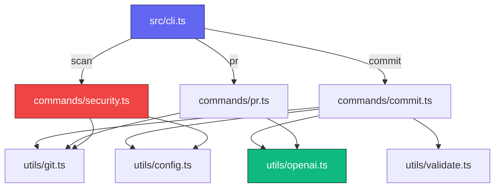

<div align="center">

# ✨ GitGlow

### *AI-Assisted Git Commit & PR Automation CLI*

[](https://github.com/fuko2935/gitglow/actions/workflows/ci.yml)
[](https://nodejs.org)
[](https://opensource.org/licenses/Apache-2.0)
[](CONTRIBUTING.md)

<p align="center">
  <b>GitGlow</b> is a developer CLI that helps you write Conventional Commit messages,
  generate Pull Request descriptions, and scan staged changes for common secret patterns —
  using OpenAI's GPT models when an API key is available, or an offline mock fallback when it isn't.
</p>

> **Status:** Early development — suitable for personal and team experimentation.
> See [Known Limitations](#-known-limitations) before using in production workflows.

---

[⚡ Features](#-features) • [🚀 Quick Start](#-quick-start) • [📖 Commands](#-commands) • [⚙️ Configuration](#️-configuration) • [🔒 Privacy](#-privacy--security) • [🧪 Testing](#-testing) • [⚠️ Known Limitations](#-known-limitations)

</div>

---

## ⚡ Features

- 🤖 **Smart Commits (`gitglow commit`)** — Reads your staged diff and generates a Conventional Commit-style message via OpenAI. Interactive prompt lets you commit, edit, regenerate, or abort. Validates the message format before committing.
- 🔍 **Secret Scanner (`gitglow scan`)** — Scans staged changes for 16+ common secret patterns (AWS keys, GitHub PATs, npm tokens, Slack tokens, Stripe keys, private key headers, JWTs, and more). Outputs file path and line number for each finding. Supports `--json` for CI integration.
- 📝 **PR Description (`gitglow pr <baseBranch>`)** — Compares your branch against a base branch and generates a structured Markdown PR description. Supports `--output <file>`, `--no-clipboard`, and `--dry-run`.
- ⚡ **Offline Mock Mode** — Use `--no-ai` or `--force-mock` to generate placeholder output without sending any data to external APIs.
- 🛡️ **Shell-Injection Safe** — All git commands use `execFileSync` with argument arrays. Branch names are validated via `git check-ref-format` before use.

---

## 🧩 Architecture



---

## 🚀 Quick Start

### Prerequisites
- **Node.js** `v18.0.0` or higher
- **git** installed and on your PATH

### Install

```bash
# Clone and install globally
git clone https://github.com/fuko2935/gitglow.git
cd gitglow
npm install
npm run build
npm link
```

Or install from npm (when published):

```bash
npm install -g @fukobabatekkral/gitglow
```

### API Key Setup (Optional)

Add your OpenAI API key as an environment variable:

```bash
export OPENAI_API_KEY="sk-..."
```

> [!IMPORTANT]
> **Never store your API key in `.gitglow.json`** — it could be accidentally committed to your repository.
> Always use the `OPENAI_API_KEY` environment variable.

> [!TIP]
> If `OPENAI_API_KEY` is not set, GitGlow automatically uses its built-in offline mock generator.
> Use `--no-ai` to explicitly force mock mode.

---

## 📖 Commands

### `gitglow commit`

Generates a Conventional Commit message from your staged diff.

```bash
gitglow commit [options]
```

| Option | Description |
|--------|-------------|
| `--no-ai` | Use offline mock mode (no data sent to OpenAI) |
| `--yes` | Non-interactive: commit immediately with the generated message |
| `--dry-run` | Print the generated message without committing |
| `--force-mock` | Alias for `--no-ai` |

**Interactive workflow:**
1. GitGlow checks for staged files.
2. Runs the secret scanner — blocks if violations are found.
3. Displays a privacy notice (when AI mode is active).
4. Generates a commit message and validates its format.
5. Prompts: **Commit** / **Edit** / **Regenerate** / **Abort**.

---

### `gitglow scan`

Scans staged changes for hardcoded secrets and credentials.

```bash
gitglow scan [options]
```

| Option | Description |
|--------|-------------|
| `--json` | Output findings as JSON (suitable for CI pipelines) |

**Detected pattern families:**
- AWS access keys (`AKIA…`, `ASIA…`, etc.)
- OpenAI API keys (`sk-proj-…`)
- GitHub tokens (`ghp_`, `gho_`, `ghs_`, `github_pat_`)
- npm access tokens (`npm_…`)
- Slack bot/user tokens (`xoxb-`, `xoxp-`)
- Stripe secret keys (`sk_live_…`)
- Private key headers (`-----BEGIN … PRIVATE KEY-----`)
- JWT tokens
- Google service account JSON markers
- Generic password/secret assignments

> [!CAUTION]
> This scanner checks only the patterns listed above.
> It does **not** guarantee the absence of all secrets.
> For comprehensive secret scanning, consider [gitleaks](https://github.com/gitleaks/gitleaks) or [truffleHog](https://github.com/trufflesecurity/trufflehog).

---

### `gitglow pr <baseBranch>`

Generates a Pull Request description from the diff between `<baseBranch>` and your current branch.

```bash
gitglow pr <baseBranch> [options]
```

| Option | Description |
|--------|-------------|
| `--no-ai` | Use offline mock mode |
| `--no-clipboard` | Do not copy to clipboard |
| `--output <file>` | Write PR description to a file |
| `--dry-run` | Print without writing to file or clipboard |
| `--force-mock` | Alias for `--no-ai` |

---

## ⚙️ Configuration

Create a `.gitglow.json` file in your project root to customise behaviour:

```json
{
  "language": "en",
  "conventionalTypes": [
    "feat", "fix", "docs", "style", "refactor",
    "perf", "test", "build", "ci", "chore"
  ],
  "maxDiffBytes": 20000,
  "model": "gpt-4o-mini"
}
```

> [!WARNING]
> Do **not** add `openaiApiKey` to this file. Use `OPENAI_API_KEY` as an environment variable instead.
> Config files committed to your repository may expose secrets.

| Key | Type | Default | Description |
|-----|------|---------|-------------|
| `language` | `string` | `"en"` | Language for AI-generated text |
| `conventionalTypes` | `string[]` | `["feat","fix",…]` | Allowed Conventional Commit types |
| `maxDiffBytes` | `number` | `20000` | Max diff size sent to OpenAI (bytes) |
| `model` | `string` | `"gpt-4o-mini"` | OpenAI model to use |
| `securityPatterns` | `array` | (16 built-in) | Custom secret patterns to add |

---

## 🔒 Privacy & Security

### What data is sent to OpenAI?

When AI mode is active (i.e., `OPENAI_API_KEY` is set and `--no-ai` is not used):

- **`gitglow commit`**: Your staged diff (up to `maxDiffBytes`) is sent to the OpenAI API.
- **`gitglow pr`**: Your branch diff and commit log (up to `maxDiffBytes`) are sent to the OpenAI API.

**`gitglow scan` never sends data to any external service.**

### How to keep diffs local

Use `--no-ai` or `--force-mock` on any command, or leave `OPENAI_API_KEY` unset.

### Shell command safety

All git operations use `execFileSync('git', [...args])` — no shell string interpolation.
Branch names provided to `gitglow pr` are validated via `git check-ref-format` before use.

### API key storage

- ✅ Store your key in `OPENAI_API_KEY` (environment variable)
- ✅ Use a secrets manager (1Password, AWS Secrets Manager, etc.)
- ❌ Do not store it in `.gitglow.json` — it may be committed to your repository

See [SECURITY.md](./SECURITY.md) for the vulnerability reporting policy.

---

## 🧪 Testing

GitGlow's test suite runs entirely without an internet connection or API key.

```bash
# Run all tests
npm test

# Watch mode
npm run test:watch

# With coverage
npm run test:coverage
```

---

## ⚠️ Known Limitations

- **Scanner coverage**: The built-in scanner covers common patterns only. It does not detect entropy-based secrets, multiline wrapped keys, or credentials in binary files.
- **AI output**: Commit messages and PR descriptions are AI-generated and should always be reviewed before use. The AI may occasionally produce incorrect or poorly formatted output.
- **Large diffs**: Diffs larger than `maxDiffBytes` are truncated before being sent to OpenAI. This may reduce the quality of generated messages.
- **Non-interactive environments**: `gitglow commit` without `--yes` or `--dry-run` requires an interactive terminal. In CI, always pass `--yes` or `--no-ai`.
- **Windows**: Clipboard support on Windows requires WSL or a compatible clipboard tool. Use `--no-clipboard --output pr.md` as a fallback.

---

## 👥 Contributors

- [fuko2935](https://github.com/fuko2935)
- [hektor808](https://github.com/hektor808)

---

## 📄 License

Apache License 2.0 — see [LICENSE](./LICENSE) for details.
