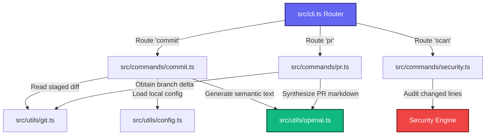

<div align="center">

# ✨ GitGlow ✨
### *Premium AI-Powered Git & PR Automation CLI*

[](https://github.com)
[](https://nodejs.org)
[](https://opensource.org/licenses/Apache-2.0)
[](https://github.com)

<p align="center">
  <b>GitGlow</b> is an enterprise-grade terminal companion designed to orchestrate your version control workflows. It uses intelligent local analysis and OpenAI's GPT models to automatically generate standardized semantic commit messages, synthesize structured markdown Pull Request descriptions, and perform zero-dependency credential audits to shield your repositories from hardcoded security keys.
</p>

---

[⚡ Features](#-features) • [🧩 Architecture](#-architecture) • [🚀 Quick Start](#-quick-start) • [📖 Command Guide](#-command-guide) • [⚙️ Configuration](#️-configuration) • [🧪 Testing](#-testing)

</div>

---

## ⚡ Features

*   🤖 **Smart Commits (`gitglow commit`)** — Analyzes your staged changes via git diffs and drafts robust, context-aware commit messages following the strict **Conventional Commits** specification.
*   🛡️ **Security Shield (`gitglow scan`)** — A high-performance, regex-based static scanning engine that inspects staged changes before commit to prevent leakages of AWS keys, OpenAI keys, GitHub PATs, and Private SSH keys.
*   📝 **PR Synthesizer (`gitglow pr <baseBranch>`)** — Compares the current branch's commits and code delta against a target branch and designs a full, beautiful Markdown template for your Pull Request.
*   ⚡ **Zero-Dependency Mock Fallback** — Can run offline or keyless using `--force-mock` or automatic keyless fallbacks, creating a seamless environment for local runs and CI.
*   🎨 **Interactive & Fluid Interface** — Powered by elegant CLI prompt menus, real-time spinners, and high-contrast color formatting.

---

## 🧩 Architecture

GitGlow is designed with a decoupled router pattern that links CLI inputs, system processes, and API services:



---

## 🚀 Quick Start

### 1. Prerequisites
- **Node.js**: `v18.0.0` or higher.
- **Git**: Properly configured in your local path.

### 2. Installation
Clone the repository and install dependencies:
```bash
# Clone the repository
git clone https://github.com/your-username/gitglow.git
cd gitglow

# Install dependencies and build
npm install
npm run build

# Link globally for terminal-wide usage
npm link
```

### 3. API Key Setup (Optional)
To leverage the full AI capability, add your OpenAI API key to your environment variables:
```bash
export OPENAI_API_KEY="sk-..."
```
> [!TIP]
> If `OPENAI_API_KEY` is not present, GitGlow will automatically fallback to its built-in heuristic mock generator so that it never breaks your dev workflow!

---

## 📖 Command Guide

### `gitglow commit`
Analyze staged changes and generate an AI-powered Conventional Commit.

```bash
gitglow commit [options]
```

**Options:**
- `--force-mock`: Force mock response for offline/keyless testing.

**Interactive Workflow:**
1. GitGlow runs `git status` to verify staged changes.
2. Compiles a cached diff.
3. Requests AI to build a Conventional Commit message.
4. Renders an interactive confirmation prompt:
   - **Commit directly**: Stages and executes the commit with the AI message.
   - **Edit**: Opens a terminal editor to refine the message manually.
   - **Regenerate**: Dispatches another request to OpenAI.
   - **Cancel**: Terminates execution cleanly.

---

### `gitglow scan`
Audit all currently staged changes for hardcoded API keys or high-risk secrets.

```bash
gitglow scan
```

**Security Policy Regexes:**
- **AWS API Key**: Matches standard AWS tokens (`AKIA`, `ASIA`, etc.)
- **OpenAI API Key**: Scans for standard and modern `sk-` credentials.
- **GitHub Token**: Captures personal access tokens (`ghp_`, `gho_`, etc.)
- **Private SSH Key**: Detects standard private keys (`-----BEGIN ... PRIVATE KEY-----`)

> [!CAUTION]
> If any credential matches are discovered, GitGlow immediately halts execution and prints the target filename, violating line, and secure instructions.

---

### `gitglow pr <baseBranch>`
Compares your current branch against `<baseBranch>` (e.g. `main`) and creates a structured Markdown PR template.

```bash
gitglow pr <baseBranch> [options]
```

**Options:**
- `--force-mock`: Force mock response for offline/keyless testing.

**What is generated:**
- 🛠️ **Summary of Proposed Changes**
- 🧩 **Modified Scope & Architecture Details**
- 🧪 **Verification & Test Status**

---

## ⚙️ Configuration

You can customize GitGlow on a per-project level by adding a `.gitglow.json` file in the root of your repository:

```json
{
  "language": "en",
  "conventionalTypes": [
    "feat",
    "fix",
    "docs",
    "style",
    "refactor",
    "perf",
    "test",
    "build",
    "ci",
    "chore"
  ],
  "openaiApiKey": "sk-..."
}
```

### Config Options
| Key | Type | Default | Description |
| :--- | :--- | :--- | :--- |
| `language` | `string` | `"en"` | Target language for AI text generation. |
| `conventionalTypes` | `string[]` | `["feat", "fix", ...]` | Approved Conventional Commit scopes/types. |
| `openaiApiKey` | `string` | `undefined` | Project-specific API key (takes secondary priority to `process.env.OPENAI_API_KEY`). |

---

## 🧪 Testing

GitGlow is backed by a fully mocked, lightning-fast test suite running on **Vitest**. No internet connection or active API keys are required to execute unit and integration tests.

```bash
# Run tests once
npm run test

# Run tests in watch mode
npm run test:watch
```

---

## 📄 License

This project is licensed under the Apache License 2.0. See the LICENSE file for details.
